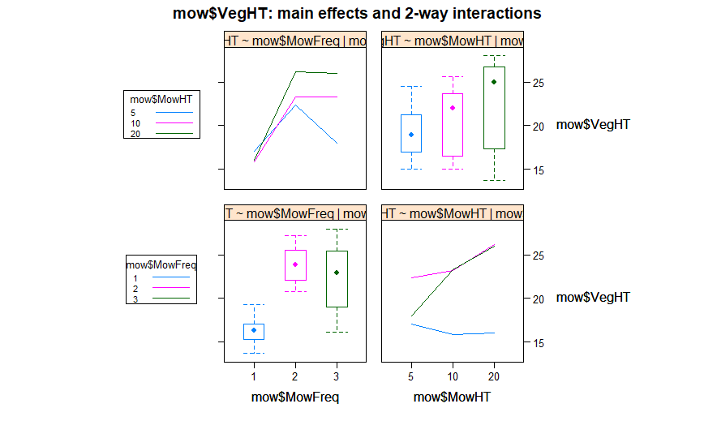

## Factorial Analysis of Variance

A vegetation height of greater than 30 centimeters on a highway right-of-way is genereally considered a safety hazard to drivers. In the Landscape Ecology Journal, a study was conducted to find the effects of mowing frequency and mowing height on vegetation height along highway right-of-ways. A random sample of 36 plots of land along a highway right-of-way were selected for the study and each were given a random mowing frequency/height treatment. Mowing frequency was set at three levels: once, twice, or three times per year and mowing height of equipment was also set at three levels: 5, 10, or 20 centimeters. At the end of the year, the vegetation height was recorded for each plot. We will conduct a 3x3 Factorial Anova to determine the effects of our two factors on the response variable and whether an interaction exists between our factors. 

The following code loads the libraries and our data. When loading the data, our independent variables mowing height (`MowHT`) and mowing frequency (`MowFreq`) are parsed as continous variables. We need these variables to be factors since factorial anova requires one continous variable and two or more categorical variables. Using `col_types`, we make sure `readr` converts these variables to the correct type.
```
library(tidyverse)
library(gplots)

mow <- read_csv(file = "MOW.csv",col_names = TRUE, col_type=cols(
  MowHT = col_factor(),
  MowFreq = col_factor()
))
```

When looking at our data, notice that `readr` automatically places our data in a tibble and our independent variables have the correct type. We also see that our data has 36 observations (plots of land) and the values of our independent variables and our response variable, vegetation height (`VegHT`), are recorded for each observation. 
```
mow
# A tibble: 36 x 3
#   MowHT MowFreq VegHT
#   <fct> <fct>   <dbl>
# 1   5     1        19.3
# 2   5     1        17.3
# 3   5     1        16.7
# 4   5     1        15  
# 5   10    1        16  
# 6   10    1        15.6
# 7   10    1        16.9
# 8   10    1        15  
# 9   20    1        16.7
# 10  20    1        17.9
# ... with 26 more rows
```

The ideal situtation for Factorial ANOVA is for each treatment to have equal sample sizes and similiar variation (standard deviation). The following code shows that our Factorial ANOVA has a balanced design and all of the treatments have a similiar standard deviation. We will talk more about why it is important and helpful to have these conditions in the future.
```

table(mow$MowHT,mow$MowFreq)

 #    1 2 3
 # 5  4 4 4
 # 10 4 4 4
 # 20 4 4 4


mow %>%
  group_by(MowHT,MowFreq)%>%
  summarise(n=n(),mean_height=mean(VegHT),sd=sd(VegHT))

# MowHT MowFreq     n  mean_height    sd
# <fct> <fct>   <int>       <dbl>   <dbl>
#  5    1           4        17.1   1.77 
#  5    2           4        22.4   1.58 
#  5    3           4        18     1.41 
# 10    1           4        15.9   0.797
# 10    2           4        23.2   1.04 
# 10    3           4        23.3   1.72 
# 20    1           4        16.0   1.77 
# 20    2           4        26.2   1.05 
# 20    3           4        26.0   1.86 
```


## Conditions Required for Valid F-Tests in Factorial Experiments.
1. Random and independent samples of experimental units are associated with each treatment.
2. The response distribution for each factor-level combination is normal.
3. The response variance is constant for all treatments.


The first assumption is satisfied since we have a random sample of plots and each were assigned a random treatment. 

If the responses for each treatment are approximately normal, then a plot of all of the residuals for our model will also be normal. Recall that Anova and Regression are both special cases of the general linear model, which is why we can use the same `lm` function for regression to find the residuals for our Factorial ANOVA. Using the residuals from the `lm` function, the Shapiro-Wilk test of the residuals shows that the residuals are approximately normal since the p-value is greather than .05, so the treatment populations are normal. Note that the order of our factors in the formula for `lm` usually matters but since we have a balanced design, changing the order of our factors will have no effect on our model.
```

model  <- lm(VegHT ~ MowFreq*MowHT,
             data = mow)

residuals = residuals(model)
shapiro.test(residuals)

# Shapiro-Wilk normality test

# data:  residuals
# W = 0.96704, p-value = 0.3504
```
We could have also looked at the normality of each treatment individually to check the first assumption. Plotting the QQ-Plot for each treatment shows that the treatment populations are normal since the data points fall along each reference line. It is important to note that ANOVA is a robust method when the assumption of normality is violated, which gives us even more confidence in satisfying this condition. 

```
ggqqplot(mow,x = "VegHT",facet.by = c("MowHT","MowFreq"))
```


When conducting a factorial ANOVA, one of the assumptions is that the response variance is constant across treatments. This assumption is commonly known as the homogeneity of variance. If the variance is not constant, the probabilities associated with tests of significance (p-values, confidence intervals, etc) will be affected. If the sample sizes among treatments are equal, this effect is lessened greatly which is another reason why balanced designs are so great. 

Unfortunately, unbalanced designs are common in factorial ANOVAs because we are dividing up our sample into many cells (subset of cases representing an intersection between factors) depending on the number of factors. Even when we do have a balanced design, we may not have enough data in the individual cells to use statistical tests or specific plots. In our example, using individual normal plots or Levene's test for variance would be less reliable than other methods at testing assumptions. This is why it is important to test assumptions in more than one way. 

If the responses for each treatments have a similiar spread, then a plot of the residuals vs. the predicted values for each observation will exhibit a constant spread. Looking below, we see that the residuals have a constant spread as predicted values increase. This means the response variance is constant for our treatments.

```
predictions = predict(model)

ggplot(mow,aes(x=predictions,y=residuals))+
  geom_point()+
  geom_hline(yintercept = 0)
```


Looking at boxplots and conducting Levene's test gives us more evidence of a constant response variance.

```
levene_test(mow,VegHT~MowFreq*MowHT)

# A tibble: 1 x 4
#    df1   df2 statistic   p
#  <int> <int>     <dbl> <dbl>
# 1  8    27     0.566   0.796

ggplot(mow,mapping=aes(MowFreq,VegHT,fill = MowHT))+
  geom_boxplot()
```


## Tests Conducted in our Factorial Experiment

#### Test for Main Effect of Mowing Height

Ho: There is no difference between the three vegetation height means for the type of mowing height used by equipment.

Ha: There is a difference between the three vegetation height means for the type of mowing height used by equipment.


#### Test for Main Effect of Mowing Frequency

Ho: There is no difference between the three vegetation height means for the type of mowing frequency.

Ha: There is a difference between the three vegetation height means for the type of mowing frequency.


#### Test for Interaction

Ho: The factors of mowing height and mowing frequency do not interact to affect mean vegetation height.

Ha: The factors of mowing height and mowing frequency do interact to affect mean vegetation height.

#### Test for Treatment Means

Ho: No difference in treatment means.

Ha: At least two treatment means differ.

## Factorial ANOVA Analysis

In our Factorial ANOVA, we want to explain the variance in vegetation height by dividing the treatment variability into three components: the main effects, interaction effects, and simple effects. Each of these components is examined and tested in the above hypotheses (some may not be used becasue they depend on the results of other hypotheses).  

The main effects of our Factorial ANOVA are similiar to the results of conducting one-way ANOVAs for each independent variable (mowing height and mowing frequency) on the dependent variable (vegetation height). The benefit of doing a Factorial ANOVA instead of individual one-way ANOVAs is that we can test for significant differences between groups of one independent variable on the dependent variable while controlling for the effects of the other independent variables and interaction effects. For example, we can test for a main effect of mowing height while partialing out the variance of vegetation height explained by mowing frequency. This allows us to find if a variable has an effect on the dependent variable beyond the effect of another variable or interaction effect.

Since we have two independent variables, our Factorial ANOVA will also produces a two-way interaction effect. We will examine this interaction effect to see if the relationship between mowing frequency and vegetation height is moderated by mowing height or vice versa. 


 

```
fit <- aov(VegHT~MowHT*MowFreq,data = mow)
summary(fit)

# Df Sum Sq Mean Sq F value   Pr(>F)    
# MowHT          2   77.9   38.95   17.57 1.29e-05 ***
# MowFreq        2  388.0  193.99   87.53 1.58e-12 ***
# MowHT:MowFreq  4   90.2   22.56   10.18 3.71e-05 ***
# Residuals     27   59.8    2.22       
```

Using a signficance level of 0.01, we see from the ouput above that our independent variables have a main effect on our dependent variable and they interact with each other to affect our dependent variable. Because an interaction is present, the main effects of our independent variables cease to have much meaning. We will look at line graphs and cell means in order to find the nature of this interaction as well as Tukey group comparisons. 

```
library(HH)

interaction2wt(mow$VegHT~mow$MowFreq*mow$MowHT)
TukeyHSD(fit)
```



Tukey multiple comparisons of means
    95% family-wise confidence level

Fit: aov(formula = VegHT ~ MowHT * MowFreq, data = mow)

$`MowHT`
          diff       lwr      upr     p adj
10-5  1.666667 0.1597229 3.173610 0.0279498
20-5  3.600000 2.0930562 5.106944 0.0000076
20-10 1.933333 0.4263895 3.440277 0.0099361

$MowFreq
         diff       lwr        upr     p adj
2-1  7.583333  6.076390 9.09027712 0.0000000
3-1  6.108333  4.601390 7.61527712 0.0000000
3-2 -1.475000 -2.981944 0.03194379 0.0559431

$`MowHT:MowFreq`
            diff         lwr        upr     p adj
10:1-5:1  -1.200  -4.7420441  2.3420441 0.9622106
20:1-5:1  -1.025  -4.5670441  2.5170441 0.9852945
5:2-5:1    5.275   1.7329559  8.8170441 0.0008569
10:2-5:1   6.175   2.6329559  9.7170441 0.0000928
20:2-5:1   9.075   5.5329559 12.6170441 0.0000001
5:3-5:1    0.925  -2.6170441  4.4670441 0.9923744
10:3-5:1   6.225   2.6829559  9.7670441 0.0000820
20:3-5:1   8.950   5.4079559 12.4920441 0.0000001
20:1-10:1  0.175  -3.3670441  3.7170441 1.0000000
5:2-10:1   6.475   2.9329559 10.0170441 0.0000444
10:2-10:1  7.375   3.8329559 10.9170441 0.0000051
20:2-10:1 10.275   6.7329559 13.8170441 0.0000000
5:3-10:1   2.125  -1.4170441  5.6670441 0.5444601
10:3-10:1  7.425   3.8829559 10.9670441 0.0000045
20:3-10:1 10.150   6.6079559 13.6920441 0.0000000
5:2-20:1   6.300   2.7579559  9.8420441 0.0000682
10:2-20:1  7.200   3.6579559 10.7420441 0.0000077
20:2-20:1 10.100   6.5579559 13.6420441 0.0000000
5:3-20:1   1.950  -1.5920441  5.4920441 0.6493444
10:3-20:1  7.250   3.7079559 10.7920441 0.0000068
20:3-20:1  9.975   6.4329559 13.5170441 0.0000000
10:2-5:2   0.900  -2.6420441  4.4420441 0.9936314
20:2-5:2   3.800   0.2579559  7.3420441 0.0285597
5:3-5:2   -4.350  -7.8920441 -0.8079559 0.0080763
10:3-5:2   0.950  -2.5920441  4.4920441 0.9909302
20:3-5:2   3.675   0.1329559  7.2170441 0.0375813
20:2-10:2  2.900  -0.6420441  6.4420441 0.1759244
5:3-10:2  -5.250  -8.7920441 -1.7079559 0.0009113
10:3-10:2  0.050  -3.4920441  3.5920441 1.0000000
20:3-10:2  2.775  -0.7670441  6.3170441 0.2182929
5:3-20:2  -8.150 -11.6920441 -4.6079559 0.0000008
10:3-20:2 -2.850  -6.3920441  0.6920441 0.1920393
20:3-20:2 -0.125  -3.6670441  3.4170441 1.0000000
10:3-5:3   5.300   1.7579559  8.8420441 0.0008057
20:3-5:3   8.025   4.4829559 11.5670441 0.0000011
20:3-10:3  2.725  -0.8170441  6.2670441 0.2372122
