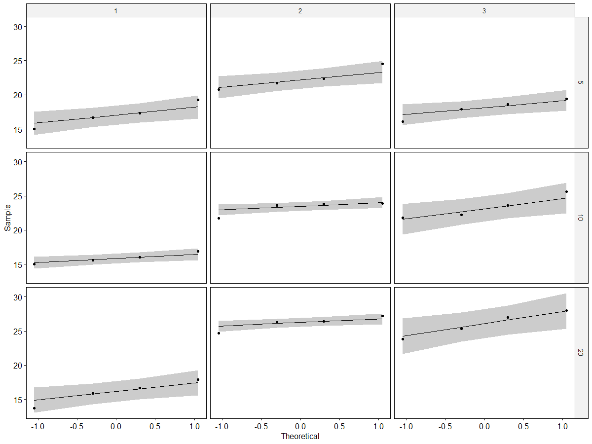
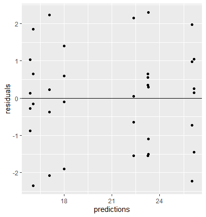
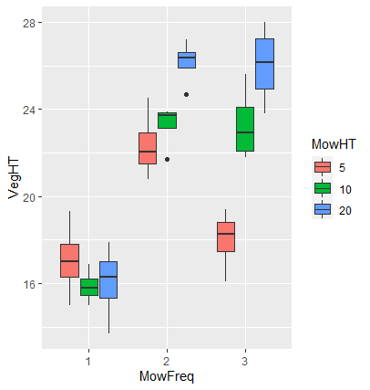

## Factorial Analysis of Variance

A vegetation height of greater than 30 centimeters on a highway right-of-way is genereally considered a safety hazard to drivers. In the Landscape Ecology Journal, a study was conducted to find the effects of mowing frequency and mowing height on vegetation height along highway right-of-ways. A sample of 36 plots of land along a highway right-of-way were selected for the study and each were given a random mowing frequency/height treatment. Mowing frequency was set at three levels: once, twice, or three times per year and mowing height of equipment was also set at three levels: 5, 10, or 20 centimeters. At the end of the year, the vegetation height was recorded for each plot. We will conduct a 3x3 Factorial Anova to determine the effects of our two factors on the response variable and whether an interaction exists between our factors. 

The following code loads the libraries and our data. When loading the data, our independent variables mowing height (`MowHT`) and mowing frequency (`MowFreq`) are parsed as continous variables. We need these variables to be factors since factorial anova requires one continous variable and two or more categorical variables. Using `col_types`, we make sure `readr` converts these variables to the correct type.
```
library(tidyverse)
library(gplots)

mow <- read_csv(file = "MOW.csv",col_names = TRUE, col_type=cols(
  MowHT = col_factor(),
  MowFreq = col_factor()
))
```

When looking at our data, notice that `readr` automatically places our data in a tibble and our independent variables have the correct type. We also see that our data has 36 observations (plots of land) and the values of our independent variables and our response variable, vegetation height (`VegHT`), are recorded for each observation. 
```
mow
# A tibble: 36 x 3
#   MowHT MowFreq VegHT
#   <fct> <fct>   <dbl>
# 1   5     1        19.3
# 2   5     1        17.3
# 3   5     1        16.7
# 4   5     1        15  
# 5   10    1        16  
# 6   10    1        15.6
# 7   10    1        16.9
# 8   10    1        15  
# 9   20    1        16.7
# 10  20    1        17.9
# ... with 26 more rows
```

The ideal situtation for Factorial ANOVA is for each treatment to have equal sample sizes and similiar variation (standard deviation). The following code shows that our Factorial ANOVA has a balanced design and all of the treatments have a similiar standard deviation. We will talk more about why it is important and helpful to have these conditions in the future.
```

table(mow$MowHT,mow$MowFreq)

 #    1 2 3
 # 5  4 4 4
 # 10 4 4 4
 # 20 4 4 4


mow %>%
  group_by(MowHT,MowFreq)%>%
  summarise(n=n(),mean_height=mean(VegHT),sd=sd(VegHT))

# MowHT MowFreq     n  mean_height    sd
# <fct> <fct>   <int>       <dbl>   <dbl>
#  5    1           4        17.1   1.77 
#  5    2           4        22.4   1.58 
#  5    3           4        18     1.41 
# 10    1           4        15.9   0.797
# 10    2           4        23.2   1.04 
# 10    3           4        23.3   1.72 
# 20    1           4        16.0   1.77 
# 20    2           4        26.2   1.05 
# 20    3           4        26.0   1.86 
```


## Conditions Required for Valid F-Tests in Factorial Experiments.
1. The response distribution for each factor-level combination is normal.
2. The response variance is constant for all treatments.
3. Random and independent samples of experimental units are associated with each treatment.

If the responses for each treatment are approximately normal, then a plot of all of the residuals for our model will also be normal. Recall that Anova and Regression are both special cases of the general linear model, which is why we can use the same `lm` function for regression to find the residuals for our Factorial ANOVA. Using the residuals from the `lm` function, the Shapiro-Wilk test of the residuals shows that the residuals are approximately normal since the p-value is greather than .05, so the treatment populations are normal. Note that the order of our factors in the formula for `lm` usually matters but since we have a balanced design, changing the order of our factors will have no effect on our model.
```

model  <- lm(VegHT ~ MowFreq*MowHT,
             data = mow)

residuals = residuals(model)
shapiro.test(residuals)

# Shapiro-Wilk normality test

# data:  residuals
# W = 0.96704, p-value = 0.3504
```
We could have also looked at the normality of each treatment individually to check the first assumption. Plotting the QQ-Plot for each treatment shows that the treatment populations are normal since the data points fall along each reference line. It is important to note that ANOVA is a robust method when the assumption of normality is violated, which gives us even more confidence in satisfying this condition. 

```
ggqqplot(mow,x = "VegHT",facet.by = c("MowHT","MowFreq"))
```



When conducting a factorial ANOVA, one of the assumptions is that the response variance is constant across treatments. This assumption is commonly known as the homogeneity of variance. If the variance is not constant, the probabilities associated with tests of significance (p-values, confidence intervals, etc) will be affected. If the sample sizes among treatments are equal, this effect is lessened greatly which is another reason why balanced designs are so great. 

Unfortunately, unbalanced designs are common in factorial ANOVAs because we are dividing up our sample into many cells (subset of cases representing an intersection between factors) depending on the number of factors. Even when we do have a balanced design, we may not have enough data in the individual cells to use statistical tests or specific plots. In our example, using individual normal plots or Levene's test for variance would be less reliable than other methods at testing assumptions. This is why it is important to test assumptions in more than one way. 

If the responses for each treatments have a similiar spread, then a plot of the residuals vs. the predicted values for each observation will exhibit a constant spread. Looking below, we see that the residuals have a constant spread as predicted values increase. This means the response variance is constant for our treatments.

```
predictions = predict(model)

ggplot(mow,aes(x=predictions,y=residuals))+
  geom_point()+
  geom_hline(yintercept = 0)
```



We also look at boxplots for each treatment and conduct Levene's test which show that the response variance is constant for each treatment. 

```
levene_test(mow,VegHT~MowFreq*MowHT)

# A tibble: 1 x 4
#    df1   df2 statistic   p
#  <int> <int>     <dbl> <dbl>
# 1  8    27     0.566   0.796

ggplot(mow,mapping=aes(MowFreq,VegHT,fill = MowHT))+
  geom_boxplot()
```


